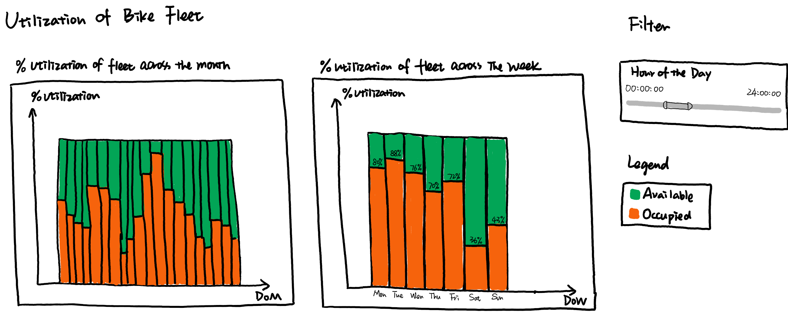

```{r setup, include=FALSE}
knitr::opts_chunk$set(echo = FALSE)
```

# Background & Motivation

The advent of shared bikes has provided people with a new way of commuting, and has picked up rapidly due to its convenience and low cost. However, there are still some problems at the current stage, such as an over-accumulation of bikes at certain areas leading to inconveniences to the public. On the flip side, there could be insufficient supply of bikes at selected stations during peak periods leading to potential users choosing an alternate form of transport. There is also the issue of overused bikes lacking maintenance/servicing at the right time intervals.

Currently, Bluebikes has a mobile app for users to locate stations and pay the fees to complete the rental process with a few clicks. However, there is currently no platform that provides an integrated analytics capability to perform exploratory analysis of the trip data and gather insights to improve the operations. This is the gap that our team is intrigued to close. We would like to design an interactive application that will help the executives of Blue Bikes to analyze and visualize users’ trip data. This application would serve as the go-to  analytics platform for gathering insights on the bike sharing operations and facilitate decision making on improvement ideas.


# Objectives

The objective of this project is to create an app using R-Shiny that will enable Bluebikes to focus on the operational optimization of their bike fleet supply at each of the stations via:

- Exploratory and Confirmatory interface to analyze bike trip duration and intensity of bike station activity

- Analyze the deficit or excess of bikes that are moving in and out of the numerous bike stations

- Optimize the utilization rate of their entire bike fleet

- Track and determine the right time to perform servicing and maintenance on the bike fleet.

# Data Source & Description

The data source for this project will be taken from Kaggle. This is the Bluebikes Trip Data for the month of Jan-2020.

**Link:** https://www.kaggle.com/rgt6899/bluebike-usage-promotion-project

The metadata and list of GPS co-ordinates and number of docks for each bike station is provided in the link below. It also contains other key data that will be used as reference for the project.

**Link:** https://www.bluebikes.com/system-data


# Data Preparation

1. Split “starttime” and “stoptime” into data and time format.
2. Derive age by using 2020 minus “birth year” and create age groups.
3. Merge the data file “202101-bluebikes-tripdata" and “current_bluebikes_stations” which contains the number of docks of each station.
4. Calculate the inbound of a station minus the outbound of a station during a time period. If the result is positive, the station has an excess. If it is negative, the station is in deficit.
5. Calculate the utilization of bikes by using the unique bike id divide the total number of bikes which we will take the number of bikes in the starting of 2020.

# Application Features

### MODULE 1 - Proportional Symbol Map to show the popularity of stations


Interactive Features:

- Filter/slider for time of day
- Selector for age group
- Selector for gender
- Customer vs. subscriber selector

### MODULE 2 - Analysis of defict/excess of bikes


Interactive Features:

- Time period selector/Day of month
- Station Name selector

### MODULE 3 - Analysis of Bike Fleet Utilization	



Interactive Features:

- Filter for time of day.

### MODULE 4 - Bike Servicing Analyzer


Interactive Features:

- Bike ID selector
- Boxplot to customize selection of data points.

# R Packages to be Utilized

| Name | Purpose |
| :---------: | :-----------------------------: |
| ggplot2 | To create the relevant graphical plots.  |
| dplyr | To manipulate the raw data to suit the needs of the project. |
| readr | To read in raw data in csv format. |
| leaflet | For building Interactive Maps. |
| RgoogleMaps | To query Google server for Static maps & to use map as background image to overlay plots. |
| ggmap | visualize spatial data and models on top of static maps. |
| mapproj | Converts latitude/longitude into projected coordinates. |
| sf (Simple features) | To standardize encoding of spatial vector data. |
| OpenStreetMap | For access to high resolution raster maps. |
| devtools | To make package development easier by providing R functions that simplify and expedite common tasks. |
| DT (DataTables) | Provides filtering, pagination, sorting, and many other features. |
| Colourpicker | To use the colorInput() and plotHelper() functions |
| ggforce | To provide a repository of geoms, stats etc. |
| Plotly |  Creating interactive web-based graphs |
| Lattice | To display multivariate relationships and support creation of trellis graphs. |
| Patchwork | To combine separate ggplots into the same graphic. |

# References

1. Bluebikes main page - https://www.bluebikes.com/
2. Bluebikes System Data - https://www.bluebikes.com/system-data
3. Bluebikes Complete Data Set for Jan 2020 - https://www.kaggle.com/rgt6899/bluebike-usage-promotion-project
4. Information on R packages - https://cran.r-project.org/web/packages
5. Top 10 R Packages for Data Visualization - https://analyticsindiamag.com/top-10-r-packages-for-data-visualisation/
6. https://www.bicyclehabitat.com/how-to/a-simple-bike-maintenance-chart-pg366.htm
7. https://www.trekbicyclestoregreensboro.com/tips/recommended-maintenance-chart-pg117.htm
8. https://bicycleuniverse.com/how-long-to-bike-mile/#

