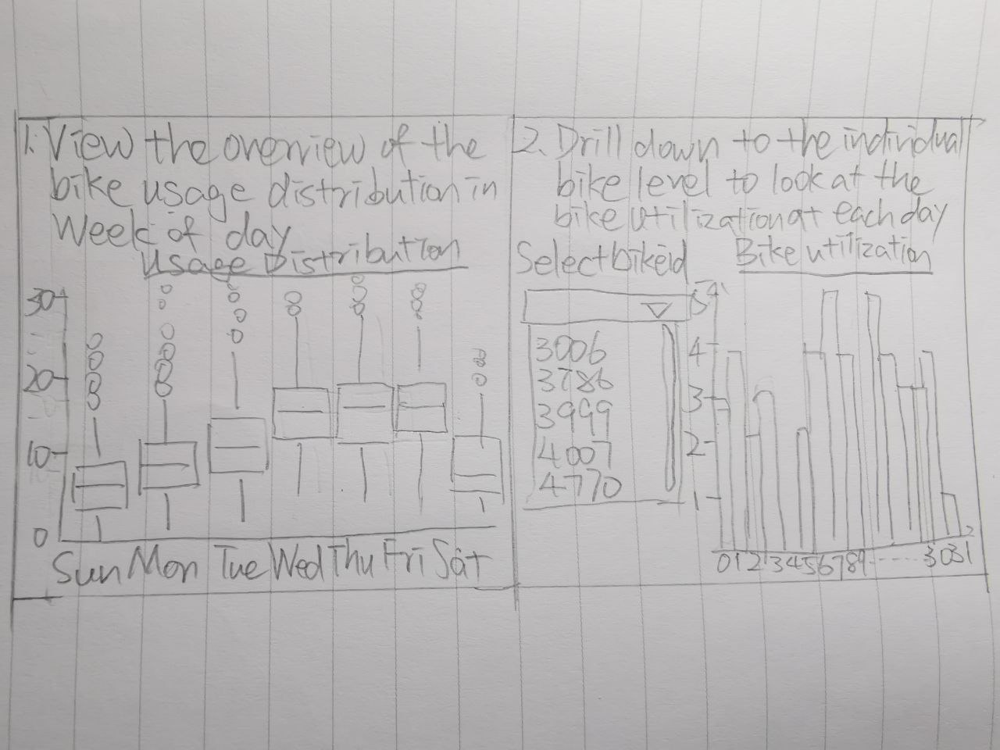

```{r setup, include=FALSE}
knitr::opts_chunk$set(echo = TRUE)
```

# 1. Introduction 

This assignment is part of the R Shiny App my team is going to build -- Enabling optimization of Bike Sharing Operations. This blog will be focusing on module 3 and 4. In the following blog, it will consisted of a literature review, data preparation and how the visualization will be built step by step, and finally the final story board.  

# 2. Literature review

Bike-sharing is often analyzed in data visualization and analytics. The most frequently analyses are focusing on the stations' demand. Sathishkumar and Cho (2020) did a season-wise bike sharing demand analysis using the random forest to predict the demand for bike. Oliveira et al (2016) did visual analytics of bike-sharing systems and that was focusing on the in-time operational status in maps displaying as they found that maps displaying the operational status kind of visualization are useful for understanding the current status of the stations only. El-Assi et al (2015) were also focusing on the demand for bikes by the station level depending on the environment and weather. Yan et al (2018) were using bike-sharing data to do a visual analytics system to investigate the user’s daily activity patterns based on tensor factorization. There are seldom analyses looking at the bike level, most of the current studies are focusing on the station level. As mentioned by Dai et al (2020) that the visualization in the map only provides basic geographic information, user might be confused if they’re not familiar with the study region. There is a lack of bike-sharing analyses focus on the bike itself, they are not looking at the individual bike utilization and bike usage on the bike level. This could help to identify if there is the issue of overused bikes lacking maintenance or servicing at the right time intervals. Analysing the bike usage could help in determining the right time to perform servicing and maintenance on the bike usage.


# 3. Data preparation

The data source for this assignment will be taken from Kaggle. This is the Bluebikes Trip Data for the month of Jan-2020.

Link: https://www.kaggle.com/rgt6899/bluebike-usage-promotion-project

Install the necessary packages.  

```{r message = FALSE, warning = FALSE}
packages = c('data.table','tidyverse','lubridate', 'plotly')
for (p in packages){
  if(!require(p, character.only = T)){
  install.packages(p)
  }
  library(p,character.only= T )
}
```


Import the bluebikes tripdata data. 

```{r message = FALSE, warning = FALSE}
#load trip data
trip <- read_csv('data/202001-bluebikes-tripdata.csv')

#Checking the overview of the dataset
glimpse(trip)
```


Prepare the data to be used for the visualization. 

```{r message = FALSE, warning = FALSE}
#separate date and time
trip <- trip %>%
 mutate_at(vars(starttime), ymd_hms) %>%
 mutate_at(vars(starttime), funs('start_date' = date(.)))

#extracting day and weekday 
trip$day <- day(trip$starttime)
trip$weekday <- wday(trip$starttime)

#convert numeric to character
trip$bikeid <- as.character(trip$bikeid)

#select relevant variable
trip_data <- select(trip, 'day', 'weekday', 'bikeid', 'usertype')

#convert into factor
trip_data$weekday <- as.factor(trip_data$weekday)

#checking the overview of the dataset
glimpse(trip_data)
```


Further data preparation for the distribution visualization.

```{r message = FALSE, warning = FALSE}
#compute the number of trips per bike in a weekday 
distribution <- table(trip_data$weekday, trip_data$bikeid)

#convert the table to data frame
fordistribution <-as.data.frame(distribution)

#rename the column name
colnames(fordistribution) <- c('week_of_day', 'bike_id', 'number_of_trips')

#mutate the weekday form number to easy understand character
fordistribution <- fordistribution %>% mutate(week_of_day=recode(week_of_day, 
                         `1`="Sun",
                         `2`="Mon",
                         `3`="Tue",
                         `4`="Wed",
                         `5`="Thu",
                         `6`="Fri",
                         `7`="Sat",
                         ))

#check the data frame 
glimpse(fordistribution)
```


# 4. Testing and prototyping the proposed sub-module (Step by step)

## Distribution of the bike trips by weekday

This is to analyze the bike trips distribution by week of day. Violin plots allow to visualize the distribution of a numeric variable for one or several groups. They are very well adapted for large dataset. We will be using the plotly to plot violin plot by having the week of day as x-axis and number of trips as the y-axis, split by the week of day as color to differentiate. In addition, a boxplot could summarizes the distribution of the number of trips by week of day. As in boxplot it only has the median, thus a mean value is added to show the average. Lastly, add a title, x-axis, y-axis labels to the violin plot. 

```{r message = FALSE, warning = FALSE}
#plot the violin 
fig <- fordistribution %>%
  plot_ly(
    x = ~week_of_day, 
    y = ~number_of_trips,
    split = ~week_of_day,
    type = 'violin',
    box = list(
      visible = T
    ),
    meanline = list(
      visible = T,
      color = 'darkblue'
    )
  ) 
# add title and label
fig <- fig %>%
  layout(
    title = "Distribution of the bike trips in week of day",
    xaxis = list(
      title = "Week of Day"
    ),
    yaxis = list(
      title = "Number of Trips",
      zeroline = F
    )
  )

fig
```

## Anyalyze each bike's utilization 

We define the utilization as the frequency of the bike used in a day. This is to display each bike's utilization by the histogram throughout the month. We have further added the user type as fill to know out of the total number of trips, to get an general idea of the distribution of the bike used by customer or subscriber.  

The prototype below is using bike id "4770" as an example, when it come to the application, we will allow user to select the bikeid from the user interface to look at the individual level of the bike. 

First pass a value and subset the data. In the actual App, the value will be passed via selector on UI. Secondly, plot the histogram using ggplot, use day of the month as the x-axis and fill with user type. Lastly, add a title to the graph. 

```{r message = FALSE, warning = FALSE}
#pass a value and subset the data, in the actual App, the value will be passed via selector on UI 
utilization <- trip_data[trip_data$bikeid==c(4770), ]
utilization <- subset(trip_data, bikeid==c(4770))

#plot the histogram 
histogram <- ggplot(utilization, aes(x= day, fill = usertype))+
  geom_histogram(color="black")

#add title
print(histogram + ggtitle("Bike utilization in a month with user type"))
```

# 5. Storyboard

User will first have an overview of the frequency of the bike been used in a month in boxplot for each weekday. 
And then user could drill down to the individual bike by filtering the bike ID which will be enabled later and have a closer look at the bike uitilization each day in a month.



Thank you for your time reading my blog. 

# 6. References

Sathishkumar and Cho (2020). Season wise bike sharing demand analysis using random forest algorithm. Computational intelligence.

Dai et al (2020). Visual analytics of urban transportation from a
bike-sharing and taxi perspective. The Visualization Society of Japan 2020.

Yan et al (2018). Visual analytics of bike-sharing data based on tensor
factorization. The Visualization Society of Japan 2018.

Oliveira et al (2016). Visual analysis of bike-sharing systems. 60 (2016) 119-112. Computers & Graphics.

El-Assi et al (2015). Effects of built environment and weather on bike sharing demand: a station level analysis of commercial bike
sharing in Toronto. Springer Science+Business Media New York 2015. 
